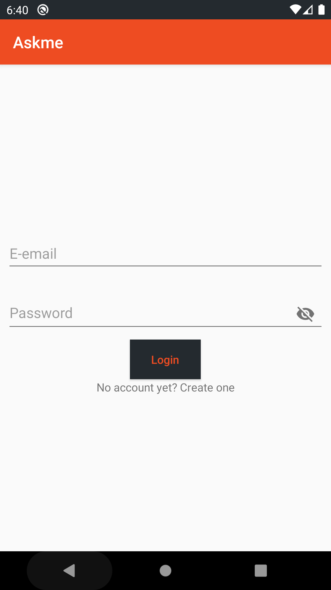
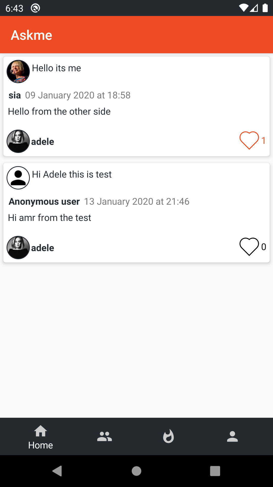
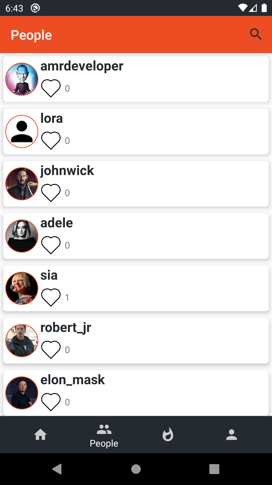
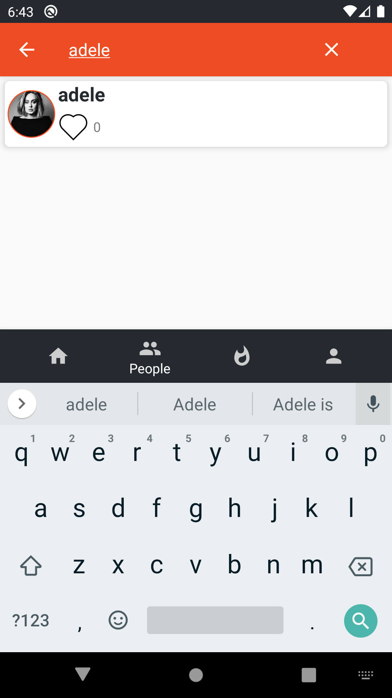
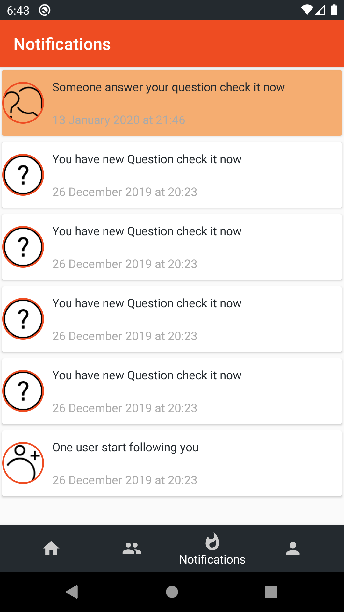
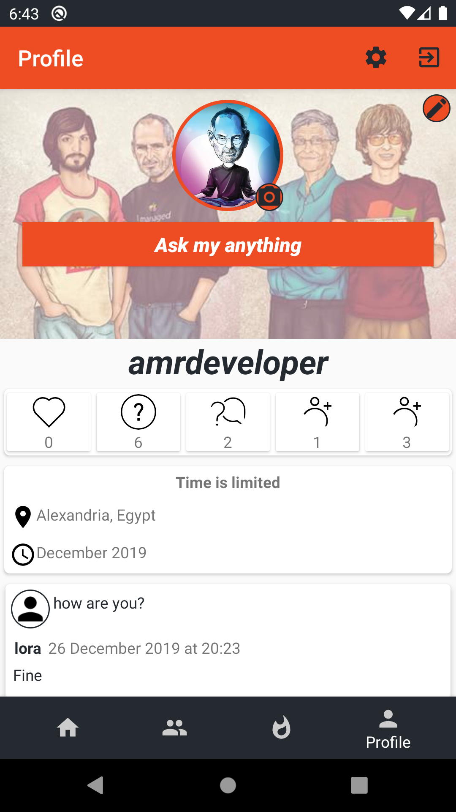
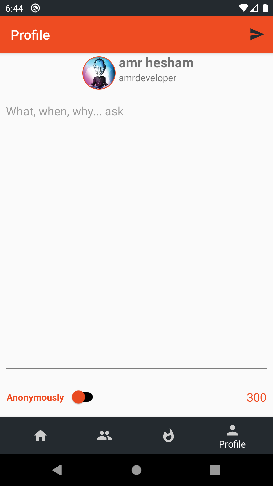
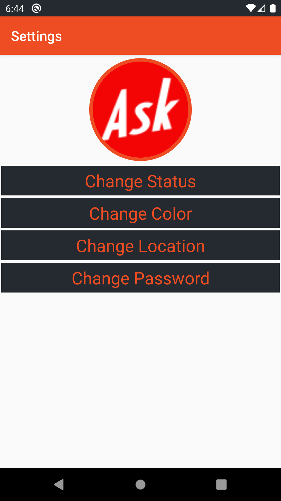
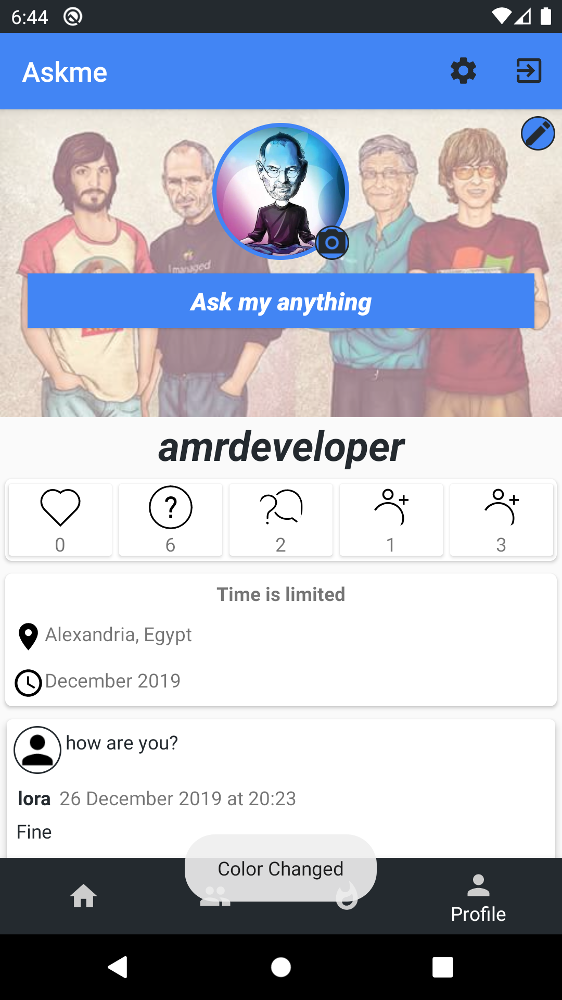
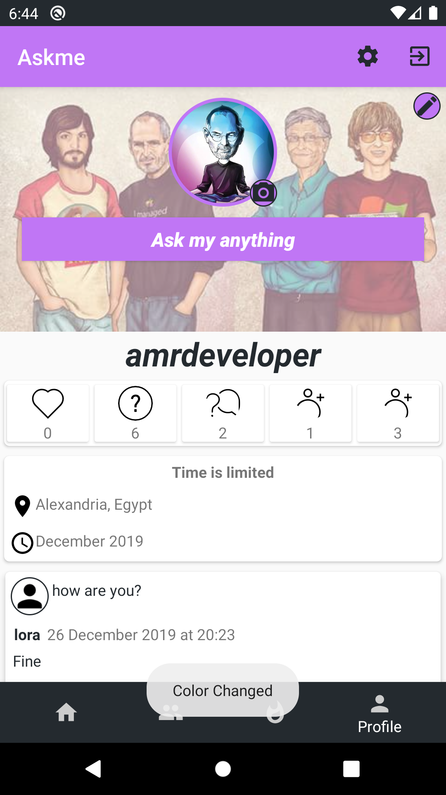

# Askme

Social media app to ask and answer user questions and interact with users

### Features : 
- Ask and answer user question
- Follow/unfollow user
- Search for users
- Home feed for all users that you follow
- Notification when got new question, answer and follower
- Update user profile image or download other user image or wallpaper
- Change App theme in runtime

### Android tools : 
- Kotlin 
- Coroutine 
- Dagger2
- MVVM Architecture
- Paging
- Architecture Components 
- Retrofit 
- GSON 
- Picasso

### Server Tools : 
- NodeJS
- Express
- MySQL
- Multer
- Bcrypt
- JWT
- Body Parser

### Screenshots

|  |  |  |

|  |  |  |

|  |  |  |

|  |  |  |

Demo video : [YouTube](https://www.youtube.com/watch?v=oNljJO5xkjU)
